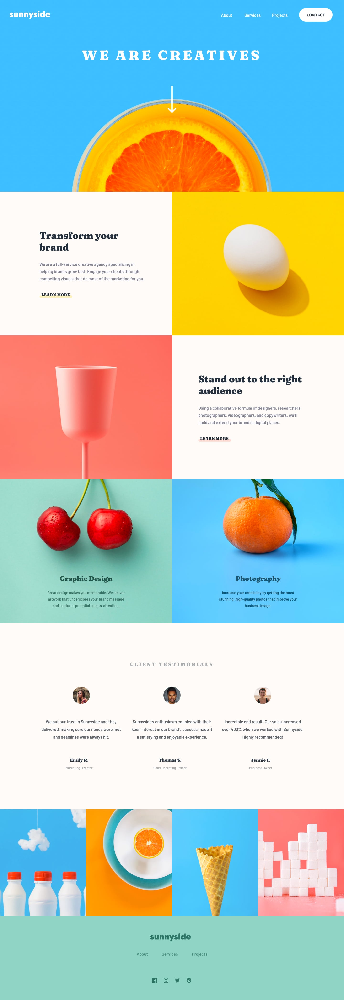

# Frontend Mentor - Sunnyside Agency Landing Page Solution

This repository contains my solution to the [Sunnyside Agency Landing Page](https://www.frontendmentor.io/challenges/sunnyside-agency-landing-page-7yVs3B6ef) challenge from Frontend Mentor. The project aims to help developers enhance their coding skills by creating realistic projects.

## Table of contents

- [Overview](#overview)
  - [The challenge](#the-challenge)
  - [Screenshot](#screenshot)
  - [Links](#links)
- [My process](#my-process)
  - [Built with](#built-with)
  - [What I learned](#what-i-learned)
  - [Continued development](#continued-development)
  - [Useful resources](#useful-resources)
- [Author](#author)
- [Acknowledgments](#acknowledgments)

## Overview

### The challenge

Users should be able to:

- View the optimal layout for the site depending on their device's screen size.
- See hover states for all interactive elements on the page.

### Screenshot

### Links

- Solution URL: [View Solution](.[https://your-solution-url.com](https://pdineshmurugan.github.io/SunnySide/))
https://pdineshmurugan.github.io/SunnySide/

## My process

### Built with

- Semantic HTML5 markup
- CSS custom properties
- Flexbox
- CSS Grid

### What I learned

This project allowed me to deepen my understanding of responsive design principles. I learned to use CSS Grid and Flexbox to create a flexible layout that adapts to various screen sizes. Additionally, I gained experience in implementing hover states for interactive elements, enhancing user experience.

### Continued development

Going forward, I want to focus on improving my JavaScript skills, particularly with state management in React. I also plan to explore more about accessibility best practices to ensure my projects are usable for everyone.

### Useful resources

- [CSS Tricks](https://css-tricks.com) - This website was helpful in understanding advanced CSS techniques.
- [MDN Web Docs](https://developer.mozilla.org/en-US/) - An excellent resource for in-depth explanations of web technologies.

## Author

- Website: [Dinesh Murugan](https://dineshmurugan.netlify.app/)
- Frontend Mentor: [@PDineshMurugan](https://www.frontendmentor.io/profile/PDineshMurugan)
- LinkedIn: [Dinesh Murugan](https://www.linkedin.com/in/dinesh-murugan-din518/)

## Acknowledgments

I want to thank the Frontend Mentor community for their valuable feedback and support throughout this project. Special thanks to everyone who provided inspiration and guidance.

## Customization Instructions

- **Screenshot**: Ensure to add your actual screenshot image to the repository.
- **Links**: Make sure to update the solution URL when available.
- **Acknowledgments**: Feel free to modify this section based on your experiences and collaborations.
